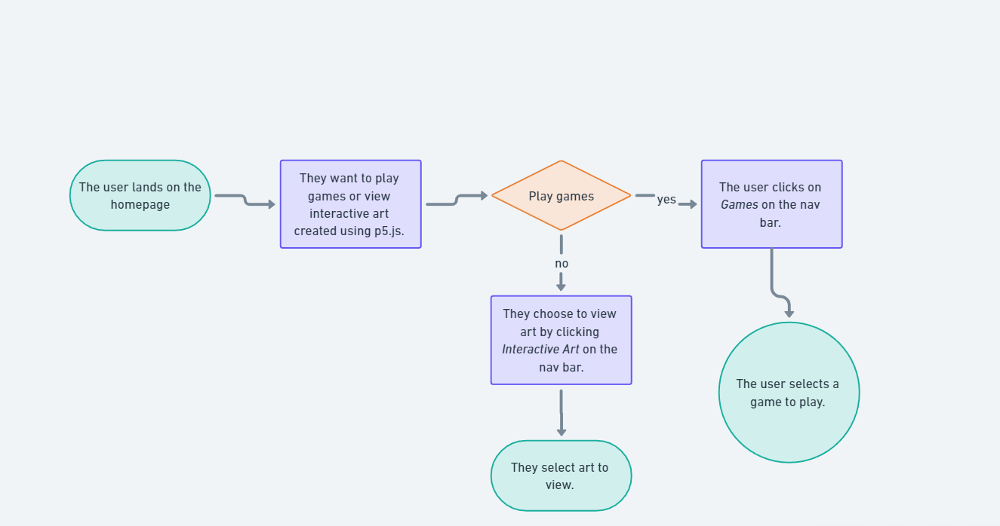

# 🐈‍⬛ SPACE CATS - USER FLOWS

The user flow for _Space Cats_ consists of two processes – a user journey where the user does not sign up and plays a game or views 3D art, and another where they sign up to perform other actions such as viewing their score, signing up for a newsletter or leaving comments.

## NOT LOGGED IN

The following image [1] displays the user flow when not logged in.

The first stage assumes the user does not wish to log in but view art or play games. For that reason, their user journey proves simple since they merely have to navigate to the games or art pages.

## LOGGED IN

The following image [1] displays the user flow when logged in.

For the second stage, the assumption is that the user either has an account or wishes to create one to perform more involved actions – such as uploading their work for review.

### REFERENCES

[1] https://whimsical.com/
