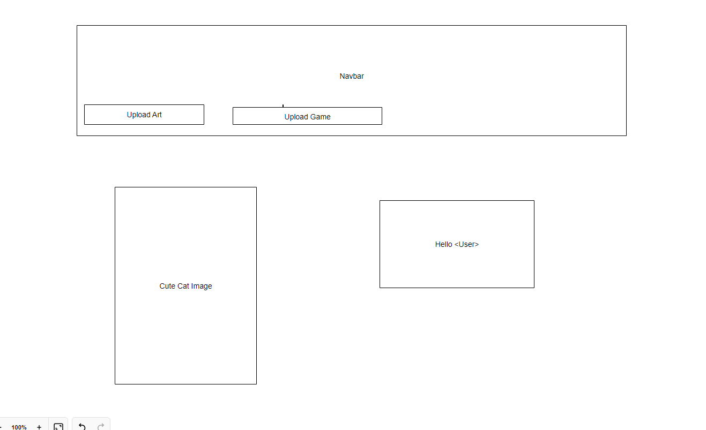

# 🐈‍⬛ SPACE CATS - WIREFRAMES

## PURPOSE OF WIREFRAMES

Wireframing refers to an early stage of the design stage; wireframes establish the basic structure of a page [1].

## INITIAL WIREFRAME FOR THE LANDING PAGE

The wireframe below shows the landing page [2].

## BARE BONES WIREFRAME FOR THE USER DASHBOARD PAGE

The wireframe below shows the user dashboard page [2].

### REFERENCES

[1] https://www.experienceux.co.uk/faqs/what-is-wireframing/

[2] https://en.wikipedia.org/wiki/Microsoft_Paint
