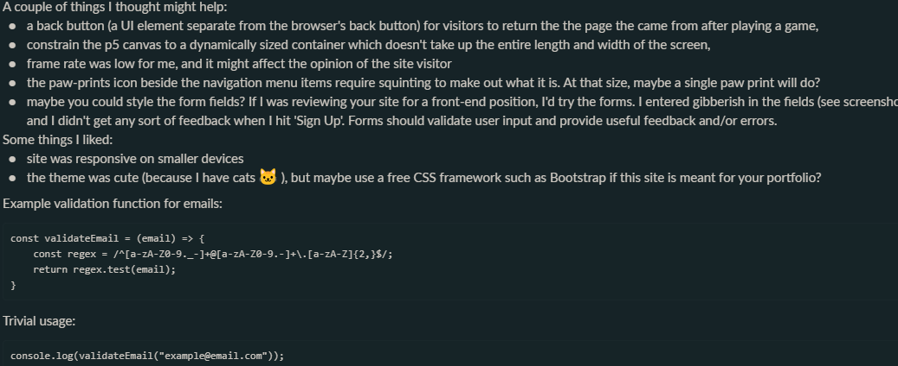

# 🐈‍⬛ SPACE CATS - FEEDBACK

The feedback to the more refined / first deployed version was mixed: people seemed fond of the idea, but the slowness of the games drew less favourable attention.

Most of the feedback was from university colleagues [1] [2].

## BACKEND

In response to the feedback, validation was added to prevent erroneous user input to emails and passwords, but the suggestion to use a refresh token [2] was not taken on board due to CORS issues, which it would have required.

## FRONTEND

Feedback on the front end -- especially in terms of repetitive code -- was left by a university colleague [2].

To improve security _localStorage_ was replaced by _sessionStorage_, and more components were added to use React's ability to break down code into smaller subsets.

However, the suggestion to use Redux [2] was disregarded due to its [complexity](../tech/stack/considered_tech.md).

## GAMES

The games were described as wonky, with lots of mouse scrolling and missed hits [1].

For that reason, changes were made to the canvas size for both the interactive art pieces and games. Subtle changes to the gameplay were made as well to improve their general playability.

## FEEDBACK

Further feedback about the games is displayed in the image below:

### REFERENCES

[1] https://github.com/world-class/REPL

[2] https://github.com/HedonisticOpportunist/Space-Cats/pull/3/files
