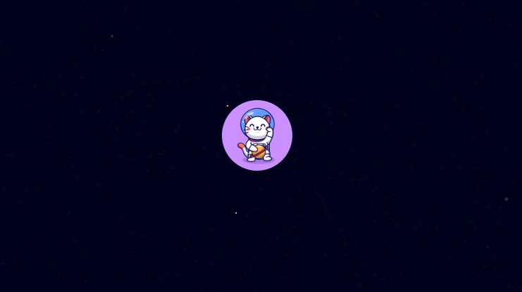
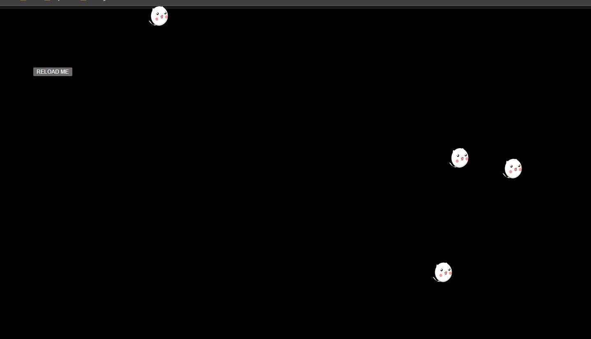

# 🐈‍⬛ SPACE CATS - ART

Due to time constraints, _**Space Cats**_ only displays two interactive images.

## FLOATING SPACE CAT

The scene is simple: the space cat [2] moves according to the user's mouse coordinates against a blue star-filled background [1].

## MANY CATS

The scene reloads upon a button click, displaying an array of cat images [3][4] in random locations.

### REFERENCES

[1] https://editor.p5js.org/ag3439/sketches/Skgh1ZQtQ

[2] https://www.facebook.com/moshimoshicatalyst

[3] https://pixabay.com/users/rosanegra_1-432510/

[4] https://editor.p5js.org/KevinWorkman/sketches/XklOOiqXa
