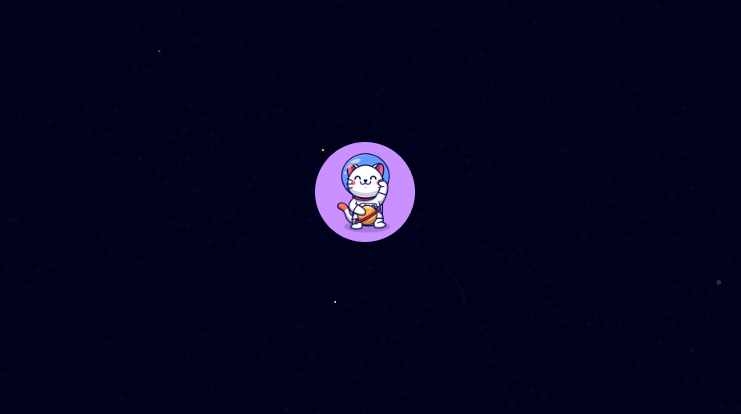
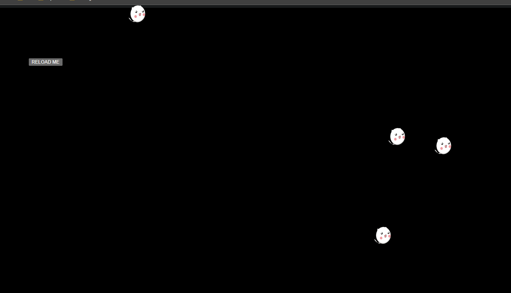

# 🐈‍⬛ SPACE CATS - ART

Due to time constraints, _**Space Cats**_ only displays two interactive images.

The motivation was to create simple yet immersive scenes that show the power of _p5.js_ [1].

## FLOATING SPACE CAT

The scene is simple: the space cat [2] moves according to the user's mouse coordinates against a blue star-filled background [3]. The canvas restricts the movements.

## MANY CATS

The scene reloads upon a button click, displaying an array of cat images [4][5] in random locations.

### REFERENCES

[1] https://p5js.org/

[2] https://www.facebook.com/moshimoshicatalyst

[3] https://editor.p5js.org/ag3439/sketches/Skgh1ZQtQ

[4] https://pixabay.com/users/rosanegra_1-432510/

[5] https://editor.p5js.org/KevinWorkman/sketches/XklOOiqXa
