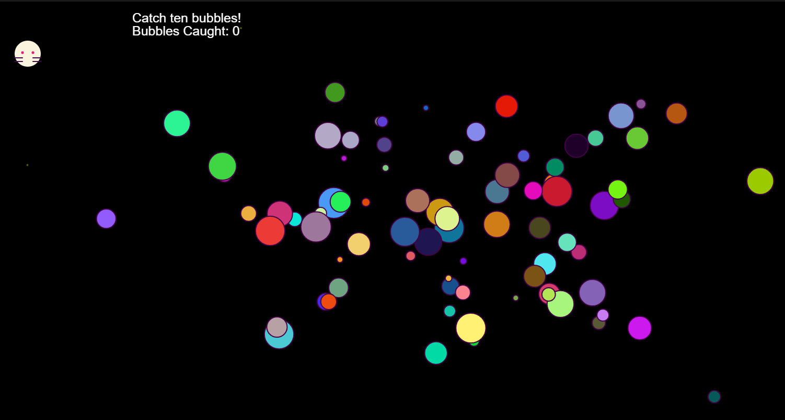
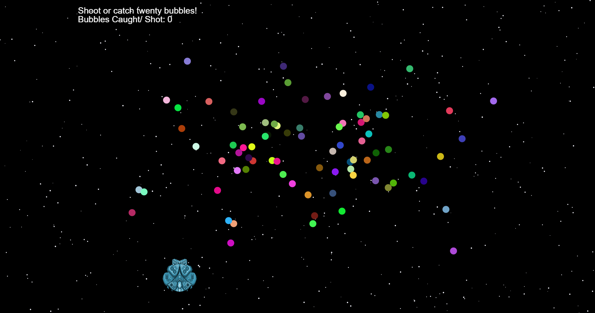

# 🐈‍⬛ SPACE CATS - GAMES

Due to time constraints, _**Space Cats**_ only displays two games that build upon each other.

## CATCH BUBBLES GAME

The following scene follows a cat [2] directed by keyboard arrow movements [3] against a star-filled background with the goal of 'catching' bubbles [4].

The bubbles' colour and size change upon scene reload. The cat is kept within the bounds of the canvas [7].

Catching bubbles increments the score by one, and the game resets once the score reaches ten.

## SPACE BUBBLES SHOOTER GAME

The scene builds upon the game above, but -- instead of a cat -- the player is a spaceship [5].

The spaceship fires bullets [6] but gains points if it comes into contact with a bubble [4].

Like in the previous game, the player stays within the boundaries of the canvas [7].

### REFERENCES

[1] https://editor.p5js.org/ag3439/sketches/Skgh1ZQtQ

[2] https://github.com/HedonisticOpportunist/Cats-in-Neath/blob/master/scripts/sketch.js

[3] https://github.com/HedonisticOpportunist/Game-Project-V2

[4] https://deepgram.com/learn/p5js-game-logic

[5] https://opengameart.org/content/colorized-boss-sprites

[6] https://linz.coderdojo.net/uebungsanleitungen/programmieren/web/space-shooter-mit-p5js/

[7] https://github.com/Gregory-Eales/uol-graphics-programming/blob/master/Asteroid-Game-Clone/sketch.js
